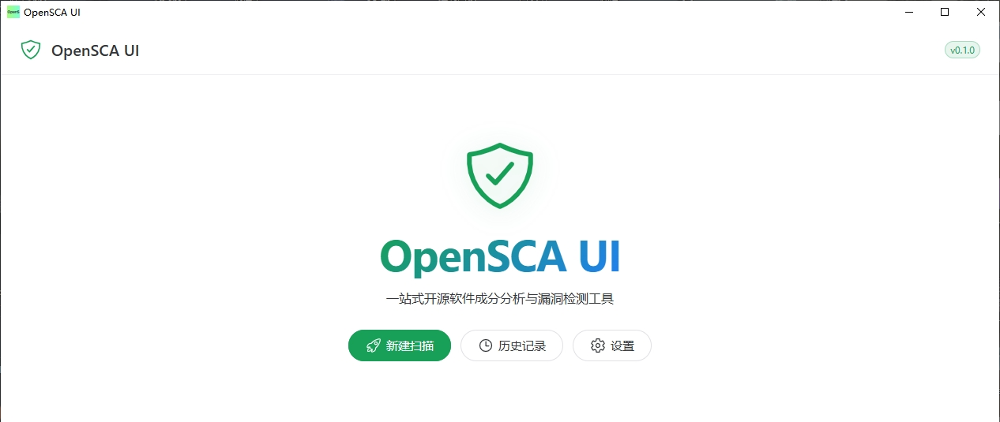

<div align="center">


# 🛡️ OpenSCA UI

**English** | **简体中文**

开源软件成分分析（SCA）工具的桌面图形化客户端，基于 [Wails](https://wails.io) 封装 [opensca-cli](https://github.com/XmirrorSecurity/OpenSCA-cli)。
**安装即用，无需单独下载 CLI。**


</div>

**OpenSCA UI** 是开源软件成分分析工具 [OpenSCA](https://opensca.xmirror.cn/) 的桌面客户端。选择项目目录或压缩包即可发起扫描，自动识别组件清单并检测已知漏洞（CVE/CWE），输出可读的漏洞报告。

内置 `opensca-cli`，安装后立即可用；支持多任务并发、实时日志、深浅色主题、CLI 一键更新。

## ✨ 功能特性

- 📁 **多方式发起扫描**：选择文件夹 / 压缩包，或直接拖拽到窗口
- 🚀 **多任务并发**：默认并发 3，可在设置中调整（1–10）
- 📜 **实时进度与日志**：逐行 stdout 流式输出，任务状态全程可见
- 🔍 **漏洞可视化**：组件清单、严重级别、CVE/CWE、修复建议；支持筛选与详情抽屉
- 📊 **报告导出**：HTML / JSON / Excel（由 opensca-cli 原生生成）
- 🌗 **浅色 / 深色主题**
- 🔄 **CLI 管理**：内置 CLI、版本更新检测、一键下载替换
- ⚙️ **丰富设置**：CLI 路径、云 / 本地漏洞库 token、报告目录、并发上限

## 🖼️ 界面预览



## 📥 安装

到 [Releases](https://github.com/DongDong1997/opensca-ui/releases) 下载最新版本：

| 文件 | 说明 |
|---|---|
| `opensca-ui-<version>-amd64-installer.exe` | NSIS 安装包（推荐，安装时自动配置内置 CLI） |
| `opensca-ui-<version>.exe` | 免安装单文件版 |

> 安装包与单文件版均已内嵌 opensca-cli，安装 / 解压后打开即用，**无需额外下载**。
> CLI 默认使用安装路径下的内置版本，也可以在「设置 → CLI」中改为其他路径（个人选择会被保留）。

## 🚀 开发

环境要求：**Go 1.25+**、**Node.js 20.19+ / 22.12+**、[Wails CLI](https://wails.io/docs/gettingstarted/installation) v2。

```bash
# 1. 拉取内置 opensca-cli（internal/bundle/opensca-cli.exe，约 20MB，仅首次需要）
powershell -ExecutionPolicy Bypass -File scripts\fetch-cli.ps1

# 2. 开发模式：自动启动 Vite dev server + Go 后端
wails dev
```

## 🔨 构建与发布

```powershell
# 单文件 exe + NSIS 安装包（版本号取自 wails.json）
powershell -ExecutionPolicy Bypass -File build.ps1
```

项目已配置 GitHub Actions，**推送 `v*` 标签**（如 `v1.0.0`）会自动构建并发布 Release：

```bash
git tag -a v1.0.0 --cleanup=verbatim -m "发布 v1.0.0" -m "# 本次更新

- 新增：xxx
- 修复：xxx"
git push origin v1.0.0
```

> Release 正文自动使用 tag 注解消息；`--cleanup=verbatim` 可保留以 `#` 开头的 Markdown 标题。

## 📁 项目结构

```
opensca-ui/
├── main.go                # Wails 启动入口
├── app.go                 # 前端绑定方法（GetConfig / StartScan / CancelScan …）
├── wails.json             # Wails 构建配置
├── build.ps1              # 一键构建脚本（exe + NSIS 安装包）
├── internal/
│   ├── bundle/            # 内置 opensca-cli（go:embed 打包，安装到应用同目录）
│   ├── config/            # 配置管理（%APPDATA%/opensca-ui/config.json）
│   ├── scanner/           # 扫描任务管理器（worker pool + subprocess）
│   └── platform/          # 跨平台路径
├── scripts/
│   └── fetch-cli.ps1      # 拉取内置 opensca-cli
├── frontend/              # Vue 3 前端
│   └── src/
│       ├── views/         # Welcome / Scan / Tasks / Report / Settings
│       ├── stores/        # Pinia：tasks / config / ui
│       ├── components/    # DropZone / TaskCard / LogViewer / VulnTable …
│       └── composables/   # useWailsEvent / useTaskStream / useTheme
└── build/                 # Wails 资源（图标 / NSIS 脚本）与构建产物
```

## 🧱 技术栈

| 层 | 技术 |
|---|---|
| 桌面框架 | [Wails v2](https://wails.io)（Go + WebView2） |
| 后端 | Go 1.25，子进程调用 opensca-cli |
| 前端 | Vue 3.5 / TypeScript 5.6 / Vite 7 |
| UI 库 | Naive UI 2.40（支持暗色主题） |
| 状态管理 | Pinia 2.2 |
| 路由 | vue-router 4（hash 模式，桌面应用无服务端） |

## 💾 数据位置

| 内容 | 路径 |
|---|---|
| 配置 | `%APPDATA%\opensca-ui\config.json` |
| 内置 CLI | `安装路径\opensca-cli.exe`（与应用 exe 同目录） |
| 任务报告 | `%APPDATA%\opensca-ui\reports\<taskID>.json` |
| 任务日志 | `%APPDATA%\opensca-ui\logs\<taskID>.log` |

## 🔒 安全提示

云漏洞库 token 目前**明文存储**于 `config.json`：

- 请勿将配置文件所在的目录整体公开
- 仅使用本地漏洞库（`-db`）时，token 可留空

## 🤝 致谢

- [XmirrorSecurity/OpenSCA-cli](https://github.com/XmirrorSecurity/OpenSCA-cli) — 底层扫描引擎
- [Wails](https://wails.io) — 桌面应用框架

## 📄 License

[MIT](LICENSE) © 2026 Panda97
